# Cenário 1 - Assistente Acadêmico Institucional

# Parte 1 - Identificação do problema

## 1.1 Descrição do problema

### Qual é o problema?

O MVP atende aluno, professor e secretaria acadêmica. A consulta cobre prazos, regras, editais, regulamentos, calendários e planos de ensino.

Em instituições do interior e em polos afastados das capitais, uma dúvida simples pode exigir várias etapas. O aluno precisa descobrir qual documento está vigente, localizar a página correta e interpretar a linguagem administrativa. O atendimento presencial também pode ficar distante, enquanto equipes pequenas respondem às mesmas dúvidas em vários cursos ou polos.

O acesso digital não elimina essa dificuldade. Na PNAD Contínua 2024, 90,2% das pessoas de 10 anos ou mais em áreas urbanas usaram internet. Nas áreas rurais, o percentual foi 81,0%. O celular é o meio mais comum de acesso, então uma interface pensada apenas para computador deixa parte desse público em desvantagem.

Uma interface conversacional reduz etapas de navegação. O aluno escreve a pergunta no vocabulário que conhece e não precisa saber o nome do documento, o setor responsável ou o caminho dentro do portal. Perguntas como "quando posso trancar uma disciplina?" ou "quantas horas de atividades complementares são exigidas?" podem ser feitas diretamente no chat.

Esse formato não resolve falta de conexão, custo de acesso ou ausência de equipamento. A proposta é menor. Quando o usuário consegue acessar o serviço, o chat exige menos conhecimento prévio sobre menus, filtros e organização interna do portal.

O sistema consulta documentos oficiais antes de responder. Regulamentos, editais, calendários e planos de ensino entram na base documental. A resposta mostra o documento, a seção ou a página usada. Questões que dependem de decisão administrativa continuam com a secretaria ou a coordenação.

### Quem utilizaria a aplicação?

Para manter o cenário controlado, o MVP terá três perfis:

| Usuário | Contexto de uso | Nível técnico |
|---|---|---|
| Aluno | Consulta regras, prazos, estágio, TCC e atividades complementares pelo portal acadêmico | Baixo a médio |
| Professor | Consulta normas acadêmicas, orientações institucionais e planos de ensino | Baixo a médio |
| Secretaria acadêmica | Localiza rapidamente regras e documentos para responder dúvidas recorrentes | Baixo a médio |

Os três usam a mesma interface. A diferença está no tipo de pergunta e nos filtros aplicados.

### Que tipo de informação o usuário gostaria de consultar?

O MVP fica restrito a três grupos de consulta:

1. Prazos e calendário acadêmico - matrícula, trancamento, provas e períodos importantes.
2. Regras e procedimentos - frequência, estágio, TCC, aproveitamento e atividades complementares.
3. Documentos acadêmicos - editais, regulamentos, planos de ensino e ementas.

Notas, situação financeira e matrícula individual do aluno ficam fora do RAG porque são dados pessoais que mudam no sistema acadêmico.

### De onde vêm essas informações?

As fontes principais são documentos oficiais da instituição:

- regulamentos e resoluções
- editais
- calendário acadêmico
- manual do aluno
- planos de ensino e ementas
- orientações publicadas pela secretaria ou coordenações
- páginas institucionais que tenham conteúdo normativo.

### Por que um LLM sozinho não seria suficiente?

Um LLM conhece padrões gerais de universidades, mas não necessariamente as regras específicas e vigentes daquela instituição. Ele também não sabe qual versão de um regulamento está valendo agora.

Por isso, a resposta precisa ser baseada em documentos oficiais recuperados no momento da consulta.

### Como o usuário vai utilizar o sistema?

O usuário acessa uma interface web, escreve uma pergunta e recebe:

- uma resposta curta
- o documento usado
- a seção ou página relevante
- um link para a fonte original, quando disponível.

No MVP, a interface web é suficiente. Uma API própria pode ser adicionada depois para integrar o mesmo serviço a aplicativo móvel ou chatbot institucional.

### Projeto real semelhante

A Univasf divulgou o UniZap em abril de 2026. O projeto foi criado por estudantes e usa WhatsApp para responder dúvidas acadêmicas em linguagem natural. A notícia da universidade cita um problema parecido com o deste trabalho: alunos têm dificuldade para localizar regras, cartilhas e serviços espalhados em diferentes canais.

O exemplo é útil porque não exige que o estudante aprenda outra interface antes de perguntar. A proposta deste MVP segue a mesma lógica de acesso por conversa, mas usa RAG para vincular cada resposta aos documentos institucionais recuperados.

O recorte rural também tem base nos dados do IBGE. Em 2024, o uso de internet entre pessoas de 10 anos ou mais foi menor em áreas rurais do que em áreas urbanas. O chat não corrige falta de conexão. Ele reduz etapas de navegação quando o acesso já existe.

Fontes: [Univasf, UniZap](https://portais.univasf.edu.br/noticias/estudantes-da-univasf-criam-chatbot-para-apoio-academico-e-tem-software-registrado-no-inpi) e [IBGE, PNAD Contínua TIC 2024](https://agenciadenoticias.ibge.gov.br/agencia-noticias/2012-agencia-de-noticias/noticias/44033-pela-primeira-vez-mais-da-metade-da-populacao-acessa-a-internet-pela-tv).

### Três perguntas reais

- "Ainda posso trancar uma disciplina depois que o período de matrícula acabou?"
- "Quantas horas de atividades complementares eu preciso entregar para concluir o curso?"
- "Quando começa o período de prova final deste semestre?"


## 1.2 Por que RAG?

### Por que RAG é adequado?

A resposta depende de uma regra institucional específica. O sistema precisa localizar essa regra antes de chamar o LLM.

No RAG, a pergunta aciona uma etapa de recuperação. Os trechos encontrados entram no contexto enviado ao modelo. A [Alura](https://www.alura.com.br/artigos/o-que-e-rag) explica esse fluxo pela recuperação de informação externa antes da geração. Neste projeto, essa informação vem dos documentos oficiais da instituição.

### Que conhecimento precisa ser fornecido ao modelo?

Principalmente:

- regras acadêmicas
- datas e prazos
- regulamentos
- editais
- ementas
- planos de ensino
- procedimentos institucionais.

### Com que frequência esse conhecimento muda?

Não é um conhecimento totalmente estático.

- Calendário acadêmico: normalmente muda a cada semestre ou ano.
- Editais: entram durante o semestre.
- Planos de ensino: podem mudar a cada oferta de disciplina.
- Regulamentos: mudam com menor frequência, mas uma atualização tem grande impacto.

Por isso, a base precisa guardar vigência e versão, não só o texto.

### Existem documentos privados ou específicos da organização?

Sim. Regulamentos internos, planos de ensino, orientações da secretaria e alguns documentos acadêmicos podem não estar disponíveis publicamente.

Documentos dados pessoais, CPF, situação financeira ou informações individuais de estudantes não devem entrar na base geral de RAG.

Documentos internos que possam entrar no RAG precisam ter uma classificação de acesso. A busca deve aplicar essa classificação antes de enviar qualquer trecho ao LLM.

### Exemplo concreto de resposta errada de um LLM sem RAG

Pergunta:

> "Posso trancar uma disciplina depois do dia 20 de agosto?"

Um LLM sem acesso às regras locais poderia responder:

> "Normalmente o trancamento é permitido até metade do semestre."

A resposta parece plausível, mas pode estar errada. O regulamento da instituição pode determinar que o prazo terminou em 15 de agosto. Nesse caso, uma resposta genérica seria pior que responder "não encontrei a informação".


## 1.3 Limitações - quando RAG não é a resposta

RAG não deve ser usado para tudo.

### Busca tradicional por palavra-chave

Ela continua útil quando o usuário sabe exatamente o termo que procura, por exemplo:

> "Edital 07/2026"

Nesse caso, procurar diretamente pelo número do edital é mais simples e previsível do que busca semântica.

### Banco de dados estruturado / SQL

SQL é melhor para dados pessoais ou que precisam de cálculo exato:

- notas
- quantidade de disciplinas cursadas
- matrícula atual
- carga horária já cumprida
- histórico individual.

Pergunta que RAG responderia mal:

> "Quantas disciplinas eu estou matriculado neste semestre?"

Essa resposta deve vir do banco do sistema acadêmico. Recuperar documentos não ajuda a descobrir a matrícula real daquele aluno.

### Regras determinísticas

Algumas validações podem ser implementadas diretamente em código.

Exemplo: se a regra oficial já estiver estruturada como "frequência mínima = 75%", um sistema pode verificar numericamente se 72% atende ao requisito. Não é necessário pedir ao LLM para fazer uma regra booleana simples.

### API

Se o sistema acadêmico expõe uma API para notas, matrícula ou frequência, ela deve ser a fonte oficial dessas informações.

### Combinação

A solução completa pode combinar técnicas:

- RAG para regulamentos
- busca por palavra-chave para código/número exato
- API/SQL para dados pessoais
- regras determinísticas para validações simples.

### E se for preciso contar, somar ou ordenar muitos documentos?

RAG baseado em recuperação top-k não garante a recuperação de todos os documentos relevantes. Perguntas como:

> "Quantos editais publicados em 2026 mencionam estágio?"

não devem ser respondidas apenas recuperando 5 chunks e pedindo para o LLM contar. O correto seria fazer uma consulta estruturada sobre metadados ou processar o conjunto completo antes da contagem.


# Parte 2 - Organização dos documentos

## Tipos de arquivo

No MVP, a base terá principalmente:

- PDF - regulamentos, editais, calendários e manuais
- DOCX - alguns planos e orientações internas
- HTML - páginas institucionais relevantes
- Markdown - formato intermediário usado após a extração.

Planilhas podem existir, mas só entram no RAG quando representam conteúdo documental. Dados tabulares operacionais devem ser tratados de forma estruturada.

Imagens, áudio e vídeo não entram na primeira versão.

## Volume aproximado

Para um piloto de uma instituição ou de poucos cursos:

- aproximadamente 50 a 150 documentos
- alguns documentos curtos, como calendários de 2 a 10 páginas
- regulamentos e manuais entre 10 e 80 páginas
- planos de ensino normalmente entre 3 e 15 páginas
- arquivos de algumas dezenas de KB até poucos MB.

Esse volume já é suficiente para testar recuperação sem transformar o trabalho em um projeto de infraestrutura.

## Frequência de atualização

- novos editais: conforme o semestre
- calendário: semestral ou anual
- planos de ensino: semestral
- regulamentos: esporádico
- documentos antigos podem ser substituídos, mas não devem simplesmente desaparecer porque a versão pode ser necessária para auditoria.

## Organização de pastas

```text
documentos/
├── calendarios/
├── regulamentos/
├── editais/
├── planos_ensino/
└── orientacoes/
```

A divisão segue a maneira como o usuário pensa a informação. Um aluno distingue naturalmente "edital", "calendário" e "regulamento". Isso também facilita filtros posteriores por `document_type`.

Não separaria inicialmente por extensão (`pdf/`, `docx/`), porque o formato técnico do arquivo é menos importante para o usuário do que o tipo do conteúdo.

## O que não deve entrar?

Não entram na base geral:

- notas individuais
- CPF ou outros dados pessoais desnecessários
- informações financeiras do aluno
- documentos sem autorização
- minutas não aprovadas
- versões obsoletas marcadas como inválidas.

Na ingestão, cada documento passa por uma validação de origem e status. Apenas arquivos marcados como `active` ou `current` entram no índice usado por padrão.

## Controle de versões

Cada documento deve ter:

- `version`
- `effective_from`
- `effective_until`
- `status`.

Exemplo:

```text
regulamento_tcc_2024.pdf -> status: archived
regulamento_tcc_2026.pdf -> status: active
```

A versão antiga pode continuar armazenada para histórico, mas a busca normal filtra `status = active`. Se o usuário perguntar explicitamente "como era a regra em 2024?", o filtro temporal pode recuperar a versão antiga.


# Parte 3 - Pipeline de ingestão

```text
Documentos
    ↓
Extração
    ↓
Limpeza / normalização
    ↓
Metadados
    ↓
Chunking
    ↓
Embeddings
    ↓
Banco vetorial
```

## 3.1 Extração

### PDFs com texto selecionável

O parser extrai diretamente:

- texto
- títulos
- páginas
- listas
- tabelas quando possível.

A página original é preservada como metadado porque será usada na citação.

### PDFs digitalizados

Se o PDF for apenas uma imagem, é aplicado OCR.

O OCR não deve ser usado em todos os documentos automaticamente. Primeiro o pipeline verifica se já existe uma camada de texto. Isso evita trabalho desnecessário e reduz erros introduzidos pelo reconhecimento.

### Tabelas

Tabelas são importantes principalmente em:

- calendários
- quadros de disciplinas
- tabelas de prazos.

Elas devem ser convertidas para uma representação estruturada ou Markdown, preservando cabeçalhos e linhas.

Exemplo:

```text
| Evento | Data |
|---|---|
| Trancamento | 15/08/2026 |
```

Transformar isso apenas em "Trancamento 15/08/2026" pode funcionar, mas perde a estrutura e fica pior quando a tabela tem muitas colunas.

### Imagens

Na primeira versão, imagens meramente decorativas, logos e assinaturas podem ser descartadas.

Se uma imagem contiver informação necessária para a consulta, como um calendário publicado apenas como imagem, ela precisa de OCR ou descrição estruturada antes da indexação.

### Documentos multimodais

O MVP não indexará áudio e vídeo. Se futuramente houver uma videoaula normativa, o conteúdo deve primeiro ser transcrito. Diagramas importantes podem receber uma descrição textual associada à página.

### Problemas possíveis

- texto extraído fora de ordem
- duas colunas sendo misturadas
- cabeçalhos entrando no meio do texto
- OCR confundindo números ou datas
- tabelas perdendo colunas
- quebra incorreta de palavras.

Nas atividades anteriores foi usado um fluxo PDF para Markdown com Docling e OCR PP-OCRv6. Esse trabalho já cobre a mesma etapa de extração prevista aqui. Os documentos desta atividade não registram uma falha específica daquele processamento, então o exemplo não é usado como evidência de erro.


## 3.2 Limpeza e normalização

### O que remover?

- cabeçalhos repetidos
- rodapés institucionais repetidos
- número de página duplicado no texto
- marcas d'água sem valor semântico
- espaços extras
- caracteres gerados incorretamente durante a extração.

### O que manter?

Não removeria automaticamente:

- números de artigos
- títulos de seções
- datas
- nomes de cursos
- referências a resoluções
- estrutura das tabelas.

Esses elementos ajudam a responder e citar corretamente.

### O que padronizar?

- UTF-8
- quebras de linha
- espaços
- datas em formato consistente nos metadados
- títulos e níveis de seção.

### Risco de limpar demais

Uma linha como:

> "Art. 14 - O trancamento poderá ser solicitado até..."

não pode virar apenas:

> "O trancamento poderá ser solicitado até..."

O número do artigo é útil para a citação. Limpeza demais pode remover justamente a informação que prova de onde veio a resposta.


## 3.3 Frequência de ingestão

O pipeline pode rodar:

- sob demanda quando um documento é enviado
- mais uma verificação diária ou periódica de novos documentos, caso a fonte seja integrada.

Se um único edital muda, apenas aquele arquivo é reprocessado.

Para detectar mudanças, o sistema mantém:

- `document_id`
- hash do arquivo
- `updated_at`
- versão.

Se o hash mudou, o documento é novamente extraído, dividido e indexado. Não há motivo para recalcular embeddings de toda a base.


# Parte 4 - Metadados

## 4.1 Schema do documento

```json
{
  "document_id": "reg-tcc-2026",
  "title": "Regulamento de TCC 2026",
  "document_type": "regulamento",
  "institutional_unit": "Coordenacao de Curso",
  "course": "Engenharia de Software",
  "version": "2026.1",
  "effective_from": "2026-01-01",
  "effective_until": null,
  "status": "active",
  "access_level": "institutional",
  "source": "portal_institucional",
  "source_url": "...",
  "updated_at": "2026-08-10"
}
```

| Metadado | Por que é útil? |
|---|---|
| `document_id` | Identifica o documento e liga todos os seus chunks |
| `title` | Permite mostrar uma fonte compreensível ao usuário |
| `document_type` | Permite filtrar edital, regulamento, calendário e outros tipos |
| `institutional_unit` | Distingue documentos publicados por setores diferentes |
| `course` | Evita recuperar uma regra de outro curso |
| `version` | Diferencia revisões do mesmo documento |
| `effective_from` | Indica quando a regra começou a valer |
| `effective_until` | Permite excluir uma regra que já perdeu a vigência |
| `status` | Separa conteúdo ativo de conteúdo arquivado |
| `access_level` | Impede que documentos restritos sejam recuperados para usuários sem permissão |
| `source` | Registra a origem do documento |
| `source_url` | Permite abrir a fonte original |
| `updated_at` | Ajuda a controlar atualização e reprocessamento |

`access_level` pode assumir valores como `public`, `institutional` e `restricted`. A autorização do usuário deve ser verificada antes da recuperação dos chunks.

## 4.2 Schema do chunk

```json
{
  "document_id": "reg-tcc-2026",
  "chunk_id": "reg-tcc-2026-014",
  "page": 12,
  "section": "Art. 14 - Prazos",
  "document_type": "regulamento",
  "course": "Engenharia de Software",
  "status": "active",
  "effective_from": "2026-01-01",
  "access_level": "institutional",
  "text": "O trancamento..."
}
```

| Metadado | Por que é útil? |
|---|---|
| `document_id` | Volta do chunk para o documento original |
| `chunk_id` | Identifica exatamente o trecho indexado |
| `page` | Permite citar a página |
| `section` | Mantém contexto e melhora a citação |
| `document_type` | Permite filtrar a busca |
| `course` | Evita mistura entre cursos |
| `status` | Impede recuperação normal de conteúdo arquivado |
| `effective_from` | Ajuda a respeitar vigência |
| `text` | É o conteúdo enviado para embedding e posteriormente ao LLM |

### Metadados usados como filtro

Exemplo:

> "Qual é a carga de atividades complementares de Engenharia de Software?"

O filtro `course = Engenharia de Software` é útil. Uma busca puramente semântica poderia recuperar um regulamento muito semelhante de outro curso.

Também são filtros úteis:

- `status = active`
- `document_type`
- período de vigência.

### Metadados usados para citação

Na tela apareceria algo como:

> Fonte: Regulamento de TCC 2026 - Art. 14 - p. 12

Com um link para `source_url`.

### Qual metadado seria caro de acrescentar depois?

`section` ou uma hierarquia como `section_path` seria caro porque depende da estrutura interna de cada documento e de cada chunk. Acrescentá-lo tarde pode exigir reabrir, reprocessar e até refazer o chunking de toda a base.

### Como extrair os metadados?

- `document_id`, origem e URL: definidos no momento da ingestão
- título, curso, versão e vigência: extraídos do documento e validados
- seção e página: obtidos pelo parser durante a extração
- tipo do documento: pode vir da pasta e ser confirmado pelo conteúdo
- `access_level` vem da política da instituição, não deve ser decidido pelo LLM
- em campos mais difíceis, um LLM com saída estruturada pode sugerir valores, mas campos críticos como vigência devem ser validados.


# Parte 5 - Chunking / Splitting

## Estratégia

Neste caso, os documentos têm estrutura clara, com artigos, capítulos, seções e parágrafos. O primeiro critério de divisão será semântico ou estrutural, não um número fixo de caracteres.

Fluxo:

1. tentar manter uma seção ou artigo inteiro
2. se a seção for grande, dividir por parágrafos
3. usar um splitter recursivo apenas como fallback.

## Tamanho aproximado

Meta inicial:

- 600 a 900 tokens por chunk
- 80 a 120 tokens de overlap quando uma seção precisar ser quebrada.

Esse tamanho é um ponto de partida, não uma regra universal. A justificativa é que regras acadêmicas normalmente cabem em poucos parágrafos, e o chunk precisa preservar condição, exceção e prazo juntos.

### Por que overlap?

Considere:

```text
Art. 14 - O trancamento pode ser solicitado...
Parágrafo único - Exceto para alunos...
```

Se a fronteira do chunk cair entre o artigo e a exceção, a resposta pode ficar errada. Um overlap pequeno ajuda a manter essa ligação.

## Estratégia por documento

- Regulamentos: artigo/seção primeiro.
- Editais: seção e item numerado.
- Calendários: tabela ou grupo de eventos.
- Plano de ensino: seções como ementa, avaliação, conteúdo e bibliografia.

Cada tipo de documento pode usar uma divisão diferente.

## Se os chunks forem pequenos demais

- perdem contexto
- regras e exceções se separam
- aumenta o número de vetores
- aparecem muitos resultados quase idênticos.

## Se forem grandes demais

- um chunk mistura assuntos
- a similaridade fica menos específica
- mais texto irrelevante é enviado ao LLM
- fica mais difícil citar o trecho correto.

## Como tratar tabelas?

Uma linha não deve ser separada de seu cabeçalho.

Se a tabela for curta, ela vira um único chunk. Se for muito grande, ela pode ser dividida em grupos de linhas, repetindo o cabeçalho em cada chunk.

## E imagens?

Imagem decorativa é descartada. Imagem informativa precisa ser convertida em texto, OCR ou descrição antes do chunking. Só depois esse conteúdo textual entra no índice.

## Como saber se o chunking foi bom?

Criaria um conjunto de aproximadamente 20 a 30 perguntas reais e registraria qual trecho deveria ser recuperado.

Depois compararia:

- se o trecho correto aparece no top 3 ou top 5
- se regra e exceção chegam juntas
- se a fonte citada está correta
- se o LLM consegue responder sem depender de outro chunk que ficou fora da busca.

Se perguntas sobre "trancamento" recuperarem repetidamente a regra sem a exceção, o chunking precisa ser ajustado.


# Parte 6 - Embeddings

## Modelo escolhido

Para este cenário, a proposta é usar OpenAI `text-embedding-3-large`.

A escolha prioriza qualidade de busca em português e simplicidade de integração por API. Como o piloto tem apenas dezenas ou poucas centenas de documentos, o custo de indexação tende a ser pequeno em comparação com a vantagem de testar uma solução pronta.

| Item | Decisão |
|---|---|
| Modelo escolhido | `text-embedding-3-large` |
| Processamento em batch | `openai/text-embedding-3-large:batch` |
| Dimensão do embedding | 3072 por padrão. A API permite reduzir |
| Suporta português? | A OpenAI descreve o modelo para tarefas em inglês e em outros idiomas. O português será validado com o conjunto de perguntas do projeto |
| É multilíngue? | Sim. A OpenAI o descreve para tarefas em inglês e em outros idiomas |
| Tamanho máximo de entrada | 8192 tokens |
| É open source? | Não |
| Pode ser executado localmente? | Não como modelo oficial distribuído pela OpenAI |
| Tem API? | Sim, endpoint de embeddings |
| Custo aproximado | US$ 0,13 por 1 milhão de tokens de entrada na tabela oficial consultada |
| Custo da variante batch consultado em agosto de 2026 | US$ 0,065 por 1 milhão de tokens |
| Fonte | [OpenAI, Vector embeddings](https://developers.openai.com/api/docs/guides/embeddings) |

A documentação da OpenAI informa 3072 dimensões por padrão e entrada máxima de 8192 tokens para `text-embedding-3-large`. A página do modelo o classifica como o embedding mais capaz da empresa para tarefas em inglês e em outros idiomas.

### Por que ele é adequado?

O cenário tem muito texto normativo em português, documentos relativamente pequenos e uma base inicial pequena. Nesse ponto do projeto, uma API reduz a manutenção do protótipo. Não é necessário manter um servidor de embeddings para indexar algumas dezenas de documentos.

### Alternativa considerada

`Qwen3-Embedding-0.6B` é uma alternativa local. A documentação da Qwen informa suporte a mais de 100 idiomas, contexto de 32K e vetores de até 1024 dimensões.

Não foi escolhido aqui porque o cenário educacional do MVP não exige, por definição, execução local e a API reduz o trabalho de infraestrutura. Se a instituição considerar os documentos sensíveis a ponto de impedir envio a um serviço externo, essa decisão muda.

### E se houver documentos sigilosos?

Nesse caso, eu avaliaria executar um embedding open-weight localmente e restringir todo o pipeline à infraestrutura da instituição. A escolha entre API e execução local depende da política de dados, do contrato e da autorização institucional.

### Relação entre limite do embedding e chunking

O limite de 8192 tokens do modelo dá flexibilidade para trabalhar com documentos de estruturas diferentes. Os chunks não precisam ter tamanho fixo. Um regulamento pode ser dividido em trechos menores, enquanto uma seção mais extensa pode permanecer agrupada quando isso preserva melhor o contexto.

A faixa de 600 a 900 tokens é apenas uma referência inicial. O pipeline pode aplicar estratégias diferentes ao mesmo documento, como divisão por artigos, seções ou blocos semânticos. Imagens, gráficos e tabelas também podem ser processados separadamente, convertendo seu conteúdo relevante em descrições ou representações textuais antes da etapa de embedding.

O uso de batch permite reunir vários desses resultados em uma mesma chamada ao modelo de embedding. Por exemplo, chunks produzidos por divisão estrutural, trechos menores, descrições extraídas de imagens e conteúdo de tabelas podem ser enviados como entradas separadas dentro do mesmo lote. Cada entrada recebe seu próprio embedding, mesmo sendo processada na mesma requisição.

Isso permite combinar diferentes estratégias de preparação sem exigir uma chamada individual para cada trecho. 

### Processamento em batch

Na geração dos embeddings existem duas formas de agrupar o processamento. A API síncrona aceita vários textos no campo `input`, permitindo enviar diversos chunks em uma única chamada. Cada entrada continua recebendo seu próprio vetor. O OpenRouter recomenda esse agrupamento para evitar uma requisição separada para cada trecho.

Para a indexação inicial dos documentos, também pode ser usada a variante `openai/text-embedding-3-large:batch`. Ela usa o mesmo modelo, aceita até 8192 tokens por entrada e custa US$ 0,065 por milhão de tokens, metade do preço da chamada síncrona comum. O processamento pela Batch API é assíncrono e trabalha com uma janela de conclusão de até 24 horas.

Essa diferença combina com as duas etapas do RAG. Na ingestão, os documentos são processados antes das consultas dos usuários, então os chunks podem ser enviados pelo modo batch e armazenados no banco vetorial quando o processamento terminar. Na consulta, o embedding da pergunta precisa ser obtido imediatamente, então é usado o `openai/text-embedding-3-large` síncrono.

Os dois fluxos usam o mesmo modelo de embedding. Isso mantém documentos e perguntas no mesmo espaço vetorial, condição necessária para comparar os vetores durante a busca semântica. O que muda é a forma de processamento e o preço, não a representação usada pelo modelo.


# Arquitetura final

```mermaid
flowchart LR

    %% =========================
    %% 0. PREPARAÇÃO DOCUMENTAL
    %% =========================
    subgraph ING["0. Preparação documental"]
        direction TB

        A["📄 PDF / DOCX / HTML"]
        B["🔤 Extração<br/>+ OCR"]
        C["🧹 Limpeza<br/>+ metadados"]
        D["✂️ Chunking"]
        E["🔢 Embeddings<br/>em batch"]
        F[("🧠 Banco<br/>vetorial")]

        A --> B
        B --> C
        C --> D
        D --> E
        E --> F
    end


    %% =========================
    %% 1. INTERAÇÃO
    %% =========================
    subgraph UI["1. Interação"]
        direction TB

        U["👤 Aluno<br/>Professor<br/>Secretaria"]
        G["💬 Interface Web"]
        H["❓ Pergunta em<br/>linguagem natural"]

        U --> G
        G --> H
    end


    %% =========================
    %% 2. PREPARAÇÃO DA CONSULTA
    %% =========================
    subgraph QUERY["2. Preparação da consulta"]
        direction TB

        I["🔢 Embedding <br/>da pergunta"]
        AC["🔐 Contexto da consulta<br/>permissão / curso / vigência"]

        H --> I
    end


    %% =========================
    %% 3. RECUPERAÇÃO
    %% =========================
    subgraph RET["3. Recuperação documental"]
        direction TB

        J["🔎 Busca vetorial<br/>+ filtros"]
        K["📑 Chunks permitidos<br/>e relevantes"]

        J --> K
    end

    AC --> J
    F --> J


    %% =========================
    %% 4. GERAÇÃO
    %% =========================
    subgraph GEN["4. Geração"]
        direction TB

        L["🤖 LLM local<br/>ou API autorizada"]
    end

    K -->|"Contexto recuperado"| L


    %% =========================
    %% 5. RESPOSTA
    %% =========================
    subgraph OUT["5. Resposta"]
        direction TB

        M["✅ Resposta<br/>+ fonte"]
    end

    L --> M
    M --> G


    %% =========================
    %% ESTILO
    %% =========================
    classDef user fill:#f5f5f5,stroke:#555,stroke-width:1.5px
    classDef query fill:#fff4cc,stroke:#b8860b,stroke-width:1.5px
    classDef rag fill:#eee8ff,stroke:#6842a8,stroke-width:1.5px
    classDef ingest fill:#eaf8ee,stroke:#37854a,stroke-width:1.5px
    classDef security fill:#ffecec,stroke:#b84a4a,stroke-width:1.5px
    classDef llm fill:#fff0e6,stroke:#c55a11,stroke-width:2px
    classDef output fill:#e8f8f1,stroke:#25865a,stroke-width:2px

    class U,G,H user
    class I query
    class AC security
    class J,F,K rag
    class A,B,C,D,E ingest
    class L llm
    class M output
```



## Tabela de decisões

| Etapa      | Decisão                                                                                                                                                                                      | Justificativa                                                                                                                                                                              |
| ---------- | -------------------------------------------------------------------------------------------------------------------------------------------------------------------------------------------- | ------------------------------------------------------------------------------------------------------------------------------------------------------------------------------------------ |
| Extração   | Usar parser de PDF e acionar OCR somente quando o documento for digitalizado ou não tiver texto pesquisável.                                                                                 | A maior parte dos regulamentos e editais pode ser processada diretamente. O OCR fica reservado aos documentos escaneados, evitando processamento desnecessário.                            |
| Limpeza    | Retirar cabeçalhos repetidos, rodapés, números isolados e outros ruídos, preservando artigos, títulos, datas, numeração e referências internas.                                              | Esses elementos ajudam a localizar a origem da resposta. Uma limpeza excessiva poderia apagar justamente os dados usados para explicar uma regra ou prazo.                                 |
| Chunking   | Dividir preferencialmente por seção, artigo ou tópico do documento. Usar aproximadamente 600 a 900 tokens, com overlap entre 80 e 120 tokens quando a divisão estrutural não for suficiente. | Regulamentos e editais já têm divisões que carregam significado. Manter artigos e seções próximos reduz a chance de recuperar uma regra sem sua condição, exceção ou prazo correspondente. |
| Metadados  | Registrar curso, tipo de documento, vigência, versão, página, seção e arquivo de origem.                                                                                                     | Os metadados permitem restringir a busca e distinguir documentos semelhantes. Também ajudam a mostrar ao usuário de onde veio a informação mostrada pelo assistente.                    |
| Embeddings | Usar `text-embedding-3-large` para representar os trechos e as perguntas no mesmo espaço vetorial.                                                                                           | A busca semântica permite recuperar trechos relacionados ao sentido da pergunta mesmo quando o aluno usa palavras diferentes das existentes no regulamento.                                |


## Riscos e limitações

- documento desatualizado pode produzir resposta errada se a vigência estiver incorreta
- OCR pode alterar datas e números
- o LLM ainda pode interpretar um trecho de forma errada
- RAG não substitui dados individuais do sistema acadêmico
- documentos muito parecidos de cursos diferentes exigem bons metadados
- indisponibilidade da API de embedding impede novas consultas que precisem gerar vetor
- usar uma API externa pode não ser permitido para conteúdo interno sensível.


# Comparação resumida com o Cenário 2

O caso educacional é principalmente documental. A maior parte das perguntas do MVP pode ser respondida recuperando regulamentos, editais e calendários.

No caso do almoxarifado, a arquitetura precisa ser mais híbrida: quantidade, localização e status atual vêm da API/SQL, enquanto manuais, descrição de uso e termos de responsabilidade entram pelo RAG.

Nos dois casos, extração, metadados, chunking, embeddings e banco vetorial continuam existindo. 

Como exercício centrado em RAG, o caso educacional exige menos integrações. O almoxarifado exige API ou SQL para estado atual e RAG para conteúdo documental.


# Como a IA foi usada nesta atividade

A IA foi utilizada para:

- revisar o escopo dos casos de uso
- ajudar a organizar as decisões do pipeline
- propor schemas iniciais de metadados
- comparar alternativas de chunking
- localizar documentação técnica para verificar as características dos modelos de embeddings.


# Referências

1. Alura. O que é RAG e como essa técnica funciona.  
   https://www.alura.com.br/artigos/o-que-e-rag

2. OpenAI. Vector embeddings.  
   https://developers.openai.com/api/docs/guides/embeddings

3. Qwen. Qwen3 Embedding: Advancing Text Embedding and Reranking Through Foundation Models.  
   https://qwenlm.github.io/blog/qwen3-embedding/


4. IBGE. PNAD Contínua TIC 2024.  
   https://agenciadenoticias.ibge.gov.br/agencia-noticias/2012-agencia-de-noticias/noticias/44033-pela-primeira-vez-mais-da-metade-da-populacao-acessa-a-internet-pela-tv

5. Univasf. Estudantes da Univasf criam chatbot para apoio acadêmico e têm software registrado no INPI.  
   https://portais.univasf.edu.br/noticias/estudantes-da-univasf-criam-chatbot-para-apoio-academico-e-tem-software-registrado-no-inpi
