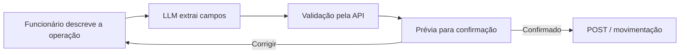
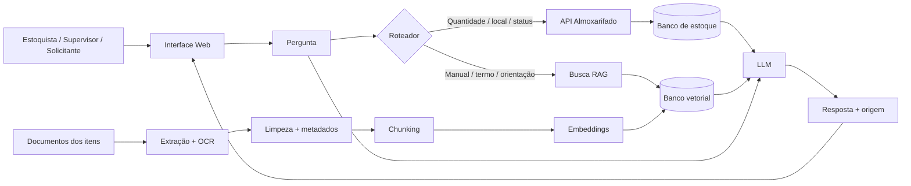

# Cenário 2 - Assistente Inteligente de Almoxarifado

# Parte 1 - Identificação do problema

## 1.1 Descrição do problema

### Qual é o problema?

Escopo do MVP: estoquista, supervisor e funcionário solicitante. Dados atuais vêm de API ou SQL. Documentos ligados aos objetos entram pelo RAG.

Em um almoxarifado de tribunal, a informação sobre um item pode ficar dividida entre cadastro, movimentações, contratos, termos de responsabilidade e manuais. O funcionário nem sempre consegue reconstruir esse histórico em uma única consulta.

A rotina considerada neste estudo parte de um sistema já existente, acessado por aplicação cliente e mantido com participação de fornecedor externo. Na prática descrita para o caso, consultas podem ser lentas e exigir abertura de telas diferentes. Para descobrir o histórico de um item, o funcionário pode precisar conferir movimentações antigas, contrato de aquisição, setor atual e documentos relacionados, um item por vez.

Existe outra fonte de erro. O banco é preenchido por funcionários. Digitação incorreta, unidade errada, categoria inadequada ou patrimônio trocado podem entrar no cadastro. Um RAG não corrige um registro já gravado de forma incorreta.

O chat pode reduzir parte dos erros de entrada quando funciona como uma camada antes da API. O funcionário escreve, por exemplo:

> "Cadastrar 10 teclados Logitech recebidos hoje para o estoque de TI."

O LLM converte a frase em campos estruturados. A API valida códigos, categorias e valores permitidos. O sistema mostra a prévia antes da gravação.

```text
Item: Teclado Logitech
Quantidade: 10
Setor: TI
Data de entrada: 19/08/2026

Confirmar cadastro?
```

A operação só é enviada após a confirmação. O erro humano continua possível, mas o fluxo reduz campos digitados sem contexto e permite validação antes do `POST`.

No modo de consulta, o roteador decide entre API, RAG ou as duas fontes. Quantidade, localização e status vêm do sistema operacional. Manuais, procedimentos e termos entram pela busca documental.

### Quem utilizaria a aplicação?

O MVP terá três perfis:

| Usuário | Contexto de uso | Nível técnico |
|---|---|---|
| Estoquista | Durante conferência, separação e entrega de materiais | Baixo a médio |
| Supervisor de almoxarifado | Controle de localização, responsáveis e movimentação operacional | Médio |
| Funcionário solicitante | Antes de pedir um item, consulta disponibilidade, finalidade e responsável | Baixo |

### Que tipo de informação o usuário gostaria de consultar?

O MVP fica restrito a três grupos:

1. Disponibilidade e localização - quantidade, sala, prateleira ou setor.
2. Descrição e orientação - finalidade, uso, armazenamento e cuidados.
3. Responsabilidade - pessoa ou setor responsável por um item/patrimônio.

### De onde vêm as informações?

Existem duas fontes oficiais.

#### API do sistema de almoxarifado

Fornece dados atuais e estruturados:

- `item_code`
- nome
- quantidade
- localização
- status
- setor
- responsável atual
- movimentações básicas.

#### Documentos associados ao objeto

Exemplos:

- manual
- ficha técnica
- termo de responsabilidade
- procedimento interno
- descrição do item
- documento de recebimento
- orientação de uso ou armazenamento.

O ponto de ligação entre as duas fontes é um identificador como `item_code`, `patrimony_id` ou categoria.

### Por que um LLM sozinho não seria suficiente?

Um LLM não sabe quantos itens existem hoje no estoque e não conhece os termos internos de responsabilidade de uma organização.

Se ele tentar responder sem consultar fontes reais, pode inventar tanto um valor de estoque quanto uma orientação sobre o objeto.

### Como o usuário vai utilizar o sistema?

O usuário acessa uma interface web em um computador do setor ou em um portal interno.

A interface conversa com:

- a API do sistema de almoxarifado
- o serviço de busca RAG.

No modo consulta, nenhuma informação é alterada: o chat apenas pesquisa a API e os documentos.

No modo cadastro ou movimentação, o LLM não grava diretamente no banco. Ele interpreta a solicitação, monta um objeto estruturado, valida os campos na API e mostra uma prévia ao funcionário. Somente depois da confirmação uma operação de escrita é enviada.



Esse desenho usa linguagem natural para diminuir a carga da interface, mas mantém regras determinísticas e a API como controle final.

A própria solução também pode expor uma API interna no futuro, mas o ponto de acesso do usuário no MVP é a interface web.

### Três perguntas reais

- "Tem notebook disponível e em qual sala ele está?"
- "Quem é responsável por este projetor?"
- "Esse produto precisa ficar armazenado em alguma condição específica?"

## 1.2 Por que RAG?

### Por que RAG é adequado?

RAG entra na parte documental do problema. 

Um manual pode dizer:

> "O equipamento deve permanecer em ambiente seco e ser transportado na embalagem protetora."

Um termo pode indicar responsabilidade e condições de uso em vários parágrafos.

Essas informações são textuais e variam na forma de escrita. Busca semântica ajuda a localizar o trecho mesmo quando a pergunta do usuário não usa exatamente as mesmas palavras do documento.

### Que conhecimento precisa ser fornecido ao modelo?

- descrição dos objetos
- finalidade
- cuidados
- instruções
- procedimentos
- termos de responsabilidade
- manuais e fichas técnicas.

Dados atuais de quantidade e localização não precisam ser "ensinados" ao LLM. Eles devem ser consultados na API quando a pergunta for feita.

### Com que frequência muda?

Existem duas velocidades diferentes:

- API do estoque: pode mudar várias vezes por dia
- documentos: normalmente mudam quando um item é adquirido, um manual é substituído, um responsável muda ou um procedimento é revisado.

Essa diferença de atualização impede que todo o caso seja tratado como RAG.

### Existem documentos privados ou específicos?

Sim. Termos de responsabilidade, procedimentos internos e documentos ligados ao patrimônio podem ser privados.

Alguns documentos podem conter:

- CPF
- CNPJ
- assinatura
- telefone
- dados pessoais desnecessários.


### Exemplo de resposta errada de um LLM sem RAG/API

Pergunta:

> "Tem três notebooks disponíveis para a equipe hoje?"

Um LLM sem acesso ao sistema poderia responder:

> "Sim, normalmente o almoxarifado mantém unidades de reserva disponíveis."

Isso seria totalmente inadequado. A disponibilidade é um fato operacional atual. A resposta correta precisa vir da API.

Outro exemplo:

> "Esse produto pode ficar perto de uma fonte de calor?"

Sem o manual, o modelo poderia dar uma orientação genérica que não corresponde ao item específico.

## 1.3 Limitações - quando RAG não é a resposta

### Busca tradicional por palavra-chave

É útil quando existe um identificador exato.

Exemplo:

> "Patrimônio 004821"

Uma busca por código é mais confiável que tentar localizar esse número por similaridade semântica.

### Banco de dados estruturado / SQL

É a melhor opção para:

- quantidade atual
- contagem
- localização
- status
- movimentações
- ordenação
- agregações.

Pergunta que RAG responderia mal:

> "Quantos notebooks estão disponíveis agora?"

SQL ou API responde diretamente algo como:

```sql
SELECT COUNT(*)
FROM items
WHERE category = 'notebook'
  AND status = 'available'
```

RAG pode recuperar documentos sobre notebooks, mas isso não representa o estoque real.

### Regras determinísticas

Algumas decisões simples podem ser aplicadas sem LLM.

Exemplo:

```text
se status != "available":
    não permitir reserva
```

O código também pode impedir que um item classificado como restrito seja mostrado a um usuário sem autorização.

### Utilização direta de API

Para "onde está?", "quanto tem?" e "qual é o status?", a API deve ser consultada diretamente.

### Combinação com RAG

Pergunta:

> "Tem projetor disponível, onde ele está e como devo transportá-lo?"

Pode exigir:

1. API para disponibilidade e localização
2. RAG para recuperar a orientação do manual
3. LLM apenas para consolidar a resposta.

### E se for preciso contar, somar ou ordenar muitos documentos?

Não é seguro depender do top-k de uma busca vetorial.

Pergunta:

> "Quantos termos de responsabilidade de 2026 estão associados ao setor de TI?"

A solução deve consultar metadados estruturados ou um banco relacional. Se o dado existir apenas dentro dos documentos, primeiro seria necessário extrair essa informação de todos eles para uma estrutura consultável.


# Parte 2 - Organização dos documentos

## Tipos de arquivo

No MVP:

- PDF - manuais, termos e procedimentos
- DOCX - procedimentos internos
- planilhas - podem existir como fonte administrativa, mas dados operacionais devem ir para o banco/API
- imagens - etiquetas ou documentos digitalizados podem aparecer
- Markdown - formato intermediário após extração.

Áudio e vídeo ficam fora da primeira versão.

## Volume aproximado

Para um piloto:

- 50 a 200 documentos
- algumas dezenas ou poucas centenas de itens catalogados
- termos e fichas: 1 a 5 páginas
- manuais: 5 a 50 páginas
- procedimentos: 2 a 20 páginas
- arquivos normalmente de dezenas de KB a alguns MB.

Não é necessário começar com todo o patrimônio da organização. Um conjunto pequeno de categorias já demonstra a arquitetura.

## Frequência de entrada

- documentos novos entram quando novos itens são adquiridos
- termos mudam quando responsabilidade é transferida
- procedimentos podem ser revisados algumas vezes por ano
- a API muda continuamente conforme entrada, saída e movimentação.

## Organização de pastas

```text
documentos/
├── manuais/
├── fichas_tecnicas/
├── termos_responsabilidade/
├── procedimentos/
└── outros/
```

A estrutura segue a função do documento.

Não usaria pastas como `notebook/`, `projetor/`, `impressora/` como divisão principal porque um mesmo item pode ter manual, termo e procedimento. A relação com o objeto deve ser feita por metadados como `item_code` e `patrimony_id`.

## O que não deve entrar?

- CPF e dados pessoais desnecessários
- documentos de outro setor sem autorização
- versões canceladas como se fossem atuais
- notas fiscais ou contratos completos quando não forem necessários ao caso de uso
- arquivos sem relação identificável com um item ou categoria
- documentos corrompidos ou sem origem conhecida.

Um estágio de validação antes da indexação verifica tipo, origem, status e presença dos identificadores mínimos.

## Controle de versões

Cada documento recebe:

- `version`
- `effective_from`
- `effective_until`
- `status`.

Termos de responsabilidade precisam de cuidado especial. Quando o responsável muda, o termo antigo pode continuar armazenado para histórico, mas não deve ser recuperado como "responsável atual" sem filtro temporal.

O responsável atual deve vir preferencialmente da API, porque é um dado operacional.


# Parte 3 - Pipeline de ingestão

```text
Documentos dos itens
    ↓
Extração
    ↓
Limpeza / normalização
    ↓
Metadados e vínculo com item
    ↓
Chunking
    ↓
Embeddings
    ↓
Banco vetorial
```

A API do estoque não passa por esse pipeline. Ela é consultada em tempo real.

## 3.1 Extração

### PDFs com texto selecionável

O parser extrai texto, títulos, páginas, listas e tabelas.

O objetivo adicional aqui é encontrar identificadores como:

- código do item
- patrimônio
- modelo
- categoria.

Esses identificadores serão usados para ligar o documento ao registro da API.

### PDFs digitalizados

Termos assinados ou documentos antigos podem estar escaneados. Nesses casos, OCR é necessário.

O resultado do OCR precisa de validação extra para números de patrimônio. Confundir:

```text
004821
```

com:

```text
004B21
```

pode ligar o documento ao item errado, o que é um erro grave.

### Tabelas

Tabelas podem conter:

- item
- quantidade
- número patrimonial
- local
- responsável.

Por isso, elas não devem ser descartadas.

A extração tenta manter cabeçalhos e linhas. Quando o conteúdo for realmente operacional e tabular, o melhor destino pode ser o banco estruturado, não o índice vetorial.

### Imagens

Existem três casos:

1. logo/assinatura decorativa: pode ser ignorado no RAG
2. etiqueta com patrimônio: deve passar por OCR
3. diagrama técnico importante: pode precisar de descrição textual ou de um fluxo multimodal futuro.

### Problemas possíveis

- OCR errado em códigos
- tabelas quebradas
- manual com duas colunas extraído fora de ordem
- documento citando vários itens e ficando difícil saber a qual item cada seção pertence
- termo digitalizado com baixa qualidade
- unidades técnicas sendo alteradas (`mm`, `kg`, `°C`)
- versões diferentes do mesmo manual.

Nas atividades anteriores já foi utilizado Docling com OCR PP-OCRv6 em um fluxo PDF para Markdown. Isso ajuda como referência de implementação da etapa de extração.

## 3.2 Limpeza e normalização

### O que remover?

- cabeçalhos repetidos
- rodapés
- paginação duplicada
- marcas d'água sem conteúdo
- espaços e quebras erradas
- caracteres estranhos de OCR.

### O que preservar?

- códigos
- patrimônio
- nomes de modelo
- unidades de medida
- avisos
- condições de temperatura
- títulos de procedimentos
- tabelas
- referência ao responsável/setor quando fizer parte do documento.

### Padronização

- texto em UTF-8
- códigos sem espaços acidentais
- datas normalizadas nos metadados
- unidades mantidas de forma consistente
- hierarquia de títulos preservada.

### Risco de limpar demais

Em um manual:

> "Temperatura de armazenamento: 5 °C a 25 °C"

não pode ser reduzido de forma que símbolos ou números desapareçam.

Em um termo:

> "Patrimônio: 004821"

o identificador é mais importante que muito do texto ao redor. Uma limpeza agressiva pode quebrar justamente a ligação com a API.


## 3.3 Frequência de ingestão

O pipeline documental roda sob demanda quando um arquivo novo entra e pode também executar uma verificação diária.

Quando um documento é atualizado:

1. calcula-se o hash
2. compara-se com a versão registrada
3. se mudou, apenas esse documento é reprocessado
4. os chunks antigos são desativados ou removidos
5. novos embeddings são gerados.

A API não é reindexada diariamente para responder saldo. Ela é consultada no momento da pergunta.


# Parte 4 - Metadados

## 4.1 Schema do documento

```json
{
  "document_id": "manual-proj-x200-v2",
  "title": "Manual Projetor X200",
  "document_type": "manual",
  "item_code": "PROJ-X200",
  "patrimony_id": "004821",
  "category": "projetor",
  "responsible_sector": "Tecnologia",
  "version": "2.0",
  "effective_from": "2026-03-01",
  "effective_until": null,
  "status": "active",
  "access_level": "restricted",
  "pii_status": "redacted",
  "source": "almoxarifado_interno",
  "updated_at": "2026-08-10"
}
```

| Metadado | Por que é útil? |
|---|---|
| `document_id` | Identifica a fonte e liga seus chunks |
| `title` | Permite mostrar uma fonte compreensível |
| `document_type` | Distingue manual, termo, ficha e procedimento |
| `item_code` | Faz a ligação principal com a API |
| `patrimony_id` | Restringe a busca a uma unidade específica |
| `category` | Permite pesquisar um grupo de objetos |
| `responsible_sector` | Registra o setor relacionado ao documento |
| `version` | Diferencia revisões |
| `effective_from` | Indica início da validade |
| `effective_until` | Evita aplicar orientação vencida |
| `status` | Exclui documento obsoleto da busca normal |
| `access_level` | Impede recuperação por usuários sem autorização |
| `pii_status` | Registra se dados pessoais desnecessários foram removidos antes da indexação |
| `source` | Registra a origem |
| `updated_at` | Permite detectar atualização |

`responsible_sector` pode ajudar no filtro documental, utilizando as permissões de acesso na rede local.

`access_level` pode usar valores como `internal` e `restricted`. O sistema verifica a permissão antes da busca vetorial.


## 4.2 Schema do chunk

```json
{
  "document_id": "manual-proj-x200-v2",
  "chunk_id": "manual-proj-x200-v2-08",
  "page": 7,
  "section": "Transporte e armazenamento",
  "document_type": "manual",
  "item_code": "PROJ-X200",
  "patrimony_id": "004821",
  "category": "projetor",
  "status": "active",
  "access_level": "restricted",
  "text": "Durante o transporte..."
}
```

| Metadado | Por que é útil? |
|---|---|
| `document_id` | Volta para a fonte original |
| `chunk_id` | Identifica o trecho recuperado |
| `page` | Permite citação precisa |
| `section` | Mantém o contexto do manual |
| `document_type` | Permite restringir busca por tipo |
| `item_code` | Impede misturar documentação de modelos diferentes |
| `patrimony_id` | Restringe conteúdo a um patrimônio |
| `category` | Permite busca por grupo de itens |
| `status` | Exclui versões inativas |
| `access_level` | Impede que um chunk restrito seja recuperado para usuário sem permissão |
| `text` | Conteúdo usado na busca semântica |

### Exemplo de filtro indispensável


Pergunta:

> "Como deve ser transportado o projetor que está na sala 3?"

Primeiro a API identifica o equipamento:

```text
item_code = PROJ-X200
patrimony_id = 004821
```

Depois a busca documental aplica esses identificadores junto com o controle de acesso:

```text
item_code = "PROJ-X200"
status = "active"
access_level IN niveis_permitidos_ao_usuario
```

Sem `item_code`, o sistema pode recuperar o manual de outro modelo. Sem controle de acesso, um documento restrito pode chegar a um usuário que não deveria recebê-lo.

### Metadado caro de acrescentar depois

`item_code`/`patrimony_id` é a ligação central da arquitetura.

Se a base for indexada sem esse relacionamento, será necessário reexaminar todos os documentos para descobrir a qual objeto pertencem. Isso pode exigir OCR, parsing e validação manual. Pior: uma associação errada liga instruções de um equipamento a outro.


### Como extrair os metadados?

- `document_id`, origem e status: definidos no processo de ingestão
- `item_code` e `patrimony_id`: extraídos do documento ou informados no upload e depois validados contra a API
- categoria: preferencialmente trazida do cadastro do item
- seção e página: parser
- vigência e versão: documento + validação
- um LLM com saída estruturada pode auxiliar na extração, mas identificadores críticos devem ser conferidos contra o sistema.


# Parte 5 - Chunking / Splitting

## Estratégia

Aqui a estratégia muda conforme o tipo do documento.

### Manuais e procedimentos

Divisão por seção/subseção, depois por parágrafo.

Meta inicial:

- 500 a 800 tokens
- 80 a 120 tokens de overlap quando uma seção precisar ser dividida.

### Fichas técnicas

São mais densas e podem ter tabelas pequenas. Em vez de quebrar apenas por tamanho, cada grupo lógico de especificações deve permanecer junto.

Exemplo:

```text
Alimentação
Voltagem: ...
Potência: ...
```

### Termos de responsabilidade

Normalmente são curtos. Um termo de 1 ou 2 páginas pode virar um único chunk ou poucos chunks, desde que dados pessoais desnecessários sejam removidos.

### Splitter recursivo

O splitter recursivo fica como fallback para seções muito grandes. Primeiro o pipeline tenta usar títulos, parágrafos e tabelas.

## Por que não usar exatamente o mesmo chunking do cenário educacional?

Um regulamento acadêmico é organizado em artigos e regras. Um manual técnico é organizado em instruções, especificações e tabelas.

Um número fixo para os dois tipos pode separar instruções ou juntar assuntos que deveriam ficar distintos.

## Chunks pequenos demais

- instruções ficam fragmentadas
- a condição pode ficar separada da ação
- uma tabela perde sentido
- aumenta o número de resultados.

## Chunks grandes demais

- mistura uso, instalação, manutenção e segurança
- reduz precisão da busca
- envia muito contexto irrelevante ao LLM.

## Como tratar tabelas?

Não cortar uma linha da tabela do cabeçalho.

Se possível, uma tabela técnica curta vira um único chunk. Em uma tabela grande, cada grupo de linhas repete o cabeçalho.

Para informações puramente tabulares e operacionais, a melhor solução pode ser extrair os campos para banco estruturado em vez de tentar resolver tudo como texto.

## Como tratar imagens?

Antes de virar chunk, a imagem precisa virar informação textual:

- OCR para etiquetas e texto
- descrição para diagrama importante.

Não faz sentido gerar embedding textual de uma imagem que foi simplesmente descartada.

## Como validar a escolha?

Criaria um conjunto de aproximadamente 20 a 30 perguntas, incluindo:

- localização + manual
- cuidados de armazenamento
- responsável
- consulta por patrimônio
- consulta por categoria.

Avaliação:

- item/documento correto aparece no top 3?
- chunks de outro modelo foram filtrados?
- tabela chegou inteira?
- a seção recuperada contém a instrução completa?
- a resposta final separa dado da API de dado documental?


# Parte 6 - Embeddings

## Modelo escolhido

Para este cenário, a escolha é Qwen3-Embedding-0.6B, com execução local como preferência.

A escolha local reduz a saída de documentos internos para serviços externos. Termos de responsabilidade podem conter dados que a organização prefira manter na própria infraestrutura.

| Item | Decisão |
|---|---|
| Modelo escolhido | `Qwen3-Embedding-0.6B` |
| Dimensão do embedding | Até 1024. Suporta dimensões configuráveis de 32 a 1024 |
| Suporta português? | Sim. O embedding declara 100+ idiomas e a família Qwen3, da qual ele herda a capacidade multilíngue, lista português explicitamente |
| É multilíngue? | Sim, 100+ idiomas |
| Tamanho máximo de entrada | 32K tokens |
| É open source/open-weight? | Pesos disponíveis sob licença Apache-2.0 no repositório oficial |
| Pode ser executado localmente? | Sim |
| Pode ser servido por API? | Sim. A aplicação pode expor o modelo local por um servidor de inferência compatível com o projeto |
| Custo aproximado | Não há cobrança por token quando a inferência é local. O custo passa a ser o da infraestrutura usada |
| Fonte | [Qwen3-Embedding-0.6B, model card oficial](https://huggingface.co/Qwen/Qwen3-Embedding-0.6B) |

O model card da Qwen informa 0,6B parâmetros, contexto de 32K, vetores de até 1024 dimensões e suporte a mais de 100 idiomas. O repositório também mostra exemplos de execução local.

### Por que é adequado?

- a base do MVP é pequena
- o modelo de 0,6B é muito menor que embeddings de vários bilhões de parâmetros
- suporta português em um contexto multilíngue
- 1024 dimensões mantêm o armazenamento vetorial simples
- permite manter documentos internos dentro da infraestrutura da organização.

### Alternativa considerada

`text-embedding-3-large` foi considerado como alternativa por API. A documentação da OpenAI informa suporte a busca por similaridade e tarefas em idiomas além do inglês. A escolha principal continua local porque os documentos podem ter conteúdo interno. 

### E se os documentos não forem sigilosos?

Nesse caso, uma API pode simplificar a operação e reduzir manutenção. A decisão deve ser revista conforme política de dados, escala e infraestrutura.

### Relação entre contexto e chunking

O modelo aceita até 32K tokens, mas isso não torna chunks de 32K desejáveis.

Os chunks continuam com 500–800 tokens porque precisam representar uma unidade técnica coerente. O contexto grande é uma margem de segurança e pode ser útil em casos especiais, não um alvo de chunking.


# Arquitetura final



## Tabela de decisões

| Etapa | Decisão | Justificativa em uma linha |
|---|---|---|
| Extração | Parser + OCR com atenção especial a códigos e tabelas | Um código de patrimônio extraído errado pode ligar o documento ao objeto errado |
| Limpeza | Remover ruído, preservando códigos, unidades e especificações | Esses detalhes têm valor operacional |
| Chunking | Estratégia por tipo. 500–800 tokens em manuais/procedimentos | Manual técnico não tem a mesma estrutura de um regulamento |
| Metadados | `item_code`, patrimônio, categoria, versão, página e seção | A busca precisa ser vinculada ao item retornado pela API |
| Embeddings | Qwen3-Embedding-0.6B local | Oferece busca multilíngue com maior controle sobre documentos internos |

## Riscos e limitações

- código de item extraído incorretamente pode relacionar documento e patrimônio errados
- responsável presente em documento pode estar desatualizado, por isso a API deve ser preferida para estado atual
- RAG não calcula estoque
- indisponibilidade da API impede respostas operacionais em tempo real
- OCR pode alterar números, unidades e códigos
- documentos de modelos parecidos podem se confundir se não houver filtro
- execução local exige manutenção da infraestrutura
- o roteador pode classificar uma pergunta híbrida incorretamente
- o LLM pode combinar as fontes e ainda interpretar um trecho de forma imprecisa. A origem precisa continuar visível.
- uma interface conversacional não corrige dados históricos já cadastrados de forma errada
- geração de campos por LLM nunca deve escrever diretamente no banco: toda inclusão ou movimentação precisa de validação e confirmação
- indisponibilidade ou lentidão do sistema legado continua afetando o chat se a API depender dele
- a causa de eventuais perdas de dados precisa de diagnóstico técnico. Não deve ser atribuída automaticamente à hospedagem externa.

# Comparação resumida com o Cenário 1

A diferença principal está na fonte de verdade.

No caso educacional, grande parte do conhecimento do MVP está em documentos. RAG ocupa o centro da arquitetura.

No almoxarifado, RAG não é a fonte de verdade para saldo, localização ou status atual. Esses dados pertencem à API/SQL. O RAG complementa a consulta com informação documental.

Outras diferenças:

- Educação filtra por curso, tipo e vigência.
- Almoxarifado filtra principalmente por item, patrimônio, categoria e versão.
- Educação divide artigos e seções.
- Almoxarifado usa estratégias diferentes para manual, ficha e termo.
- Educação pode priorizar simplicidade de API para embeddings.
- Almoxarifado pode priorizar execução local por privacidade.

As etapas gerais de ingestão são iguais porque são boas práticas de um pipeline RAG. O conteúdo e a justificativa de cada etapa, porém, não são os mesmos.

Para um protótipo de RAG com poucas integrações, o caso educacional é mais curto. O almoxarifado exige roteamento entre RAG e API ou SQL e mostra melhor a separação entre documento e dado operacional.

# Como a IA foi usada nesta atividade

A IA foi usada para:

- reorganizar o escopo
- revisar os casos de uso
- propor o pipeline
- comparar alternativas de chunking
- sugerir metadados
- localizar documentação técnica dos modelos de embeddings.

As características do `Qwen3-Embedding-0.6B` foram verificadas no material oficial da Qwen. O model card informa contexto de 32K, dimensão de até 1024 e suporte a mais de 100 idiomas.

# Referências

1. Alura. O que é RAG e como essa técnica funciona.  
   https://www.alura.com.br/artigos/o-que-e-rag

2. Qwen. Qwen3-Embedding-0.6B, model card oficial.  
   https://huggingface.co/Qwen/Qwen3-Embedding-0.6B

3. OpenAI. Vector embeddings.  
   https://developers.openai.com/api/docs/guides/embeddings

